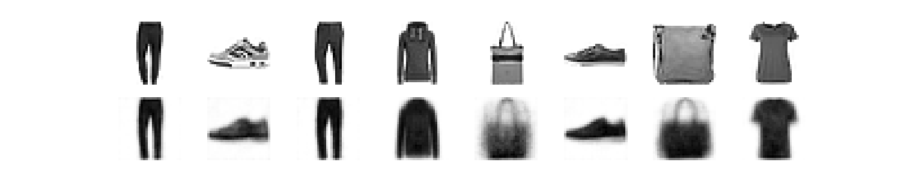

# **Image-Generation-Using-Convolutional-Autoencoder**

## **Autoencoders**

----------

<p align="center">
  
  <br>
  (Image source <a href="https://blog.keras.io/building-autoencoders-in-keras.html"> Keras</a>)
</p>

An **autoencoder** is a neural network that is trained to attempt to copy its input to its output. Internally, it has a hidden layer ***h*** that describes a **code** used to represent the input. The network may be viewed as consisting of two parts: an ``encoder`` function ***h***=*f(***x***)* and a ``decoder`` that produces a reconstruction r=*g*(***h***). If an autoencoder succeeds in simply learning to set *g(f(***x***))* = ***x*** everywhere, then it is not especially useful. Instead, autoencoders are designed to be unable to learn to copy perfectly. Usually they are restricted in ways that allow them to copy only approximately, and to copy only input that resembles the training data. Because the model is forced to prioritize which aspects of the input should be copied, it often learns useful properties of the data. [[1]](https://www.deeplearningbook.org/)

## **Image Autoencoder**

----------

<p align="center">
  
  (The first line shows the input images, and the second presents the ones generated by the autoencoder.)
</p>

This project introduces an exemple of a ``convolutional autoencoder`` that reads an input image, encodes the image into a lower dimensional latent representation, then decodes the latent representation to reconstruct the imput image.
The autoencoder is implemented using the [Keras](https://keras.io/), and it is based on convolutional neural networks levraging [Conv2D](https://keras.io/api/layers/convolution_layers/convolution2d/) layers in the ``encoder``, and [Conv2DTranspose](https://keras.io/api/layers/convolution_layers/convolution2d_transpose/) layers in the ``decoder``.
The autoencoder is trained using the [Fashion MNIST](https://github.com/zalandoresearch/fashion-mnist) dataset. Each image in this dataset is 28x28 pixels. For this reason, the input shape of the ``encoder`` was set to ``(28, 28, 1)`` as well as for the output shape of the ``decoder``.

## Scripts

----------

* ``conv_autoencoder.py``: contains the implementation of the convolutional autoencoder class.

* ``train_conv_autoencoder.py``: trains the autoencoder model on the [Fashion MNIST](https://github.com/zalandoresearch/fashion-mnist) dataset, and saves the weights and parameters of the model under ``model`` directory in the project folder.

* ``generator.py``: loads the saved model and runs it on a ramdom sample from the test set to generate simiar images, and plots their latent representations.

## Installation

--------------

Install Python (>=3.6):

```
    sudo apt-get update
    sudo apt-get install python3.6
```

Clone this repository:

```
git clone https://github.com/wiguider/Image-Generation-Using-Convolutional-Autoencoder.git
```

Install the requirements:

```
pip install -r requirements.txt
```
